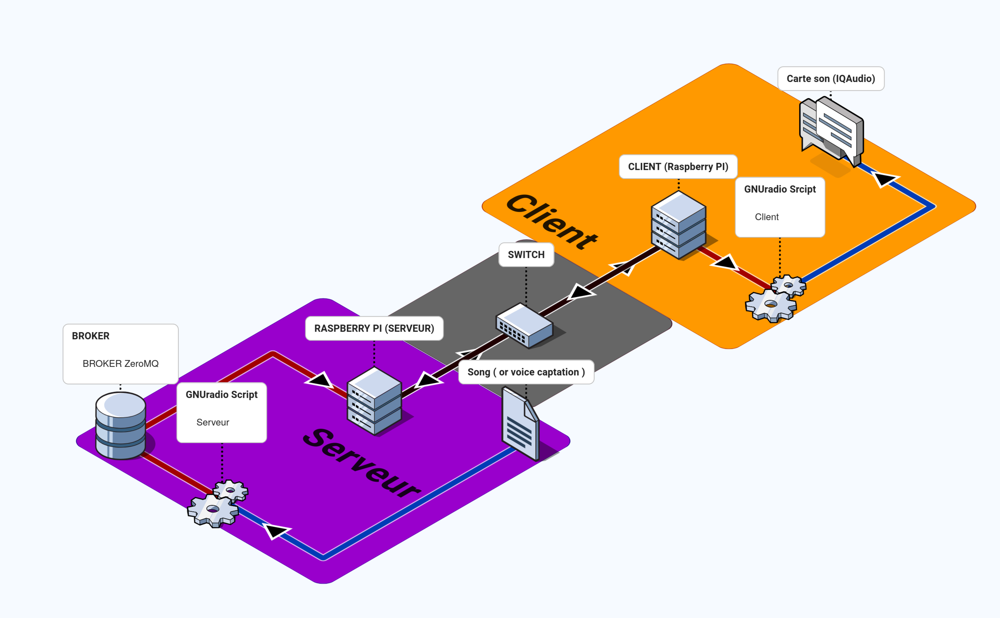

# Introduction

## Pré-requis

* **2 Raspberry Pi 3** (minimum)
* **2 cartes microSD** (>= 8 Go)
* **1 câble Ethernet** (RJ45)
* **1 IQAudio Zero Codec** pour la sortie audio
  + Sortie via Jack
  + Option "Relais" du IQAudio pour amplification directe
* GNU Radio installé sur chaque Raspberry Pi
* Système d’exploitation Raspberry Pi OS à jour (mode no-desktop)
* docker installer sur chaque RPI 

TODO: FAIRE les fichiers Dockerfil et page pour installation docker

## Fonctionnement
