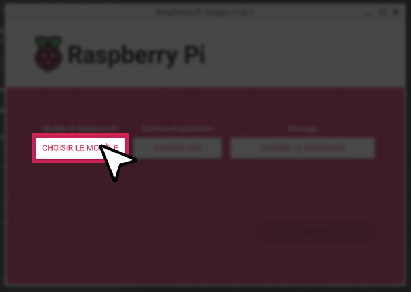
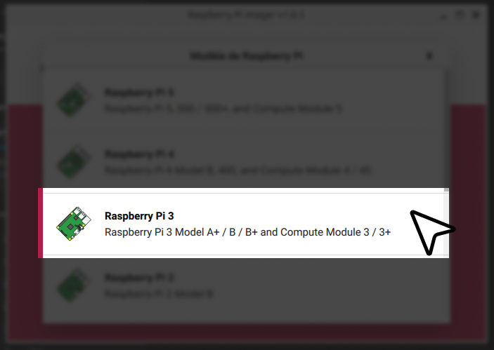
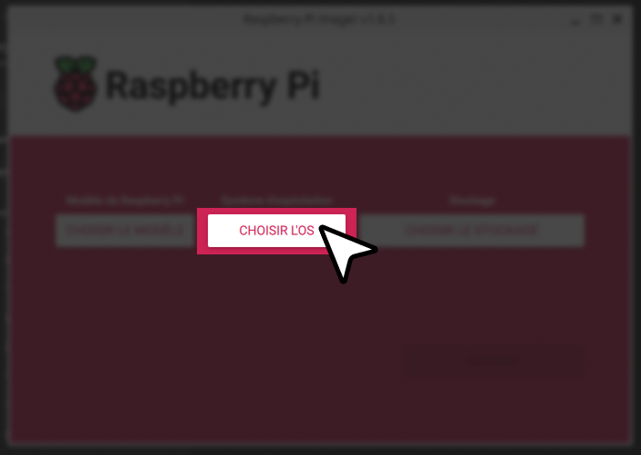
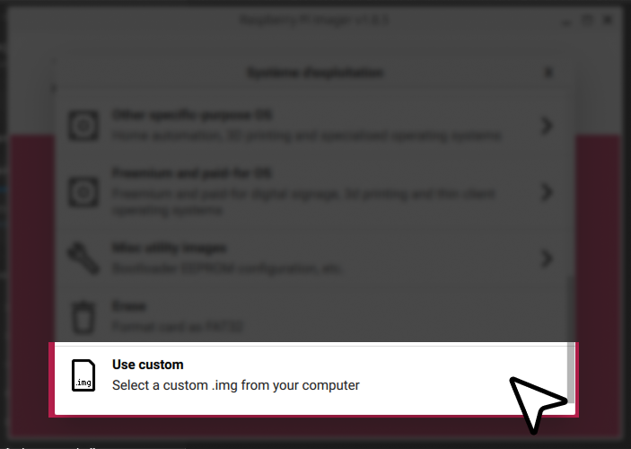
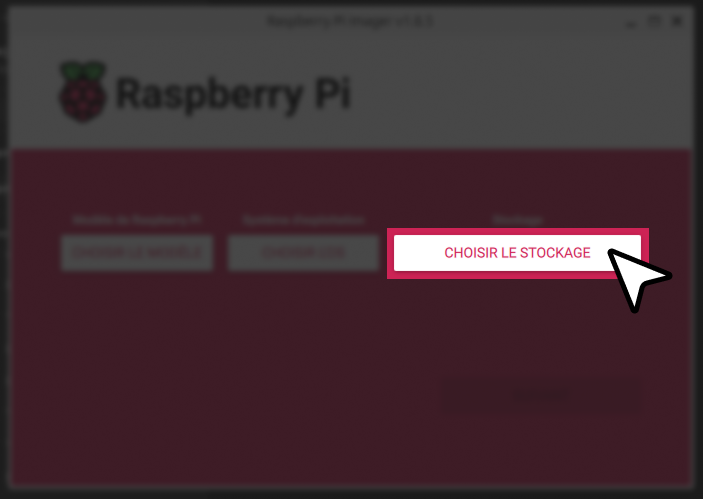
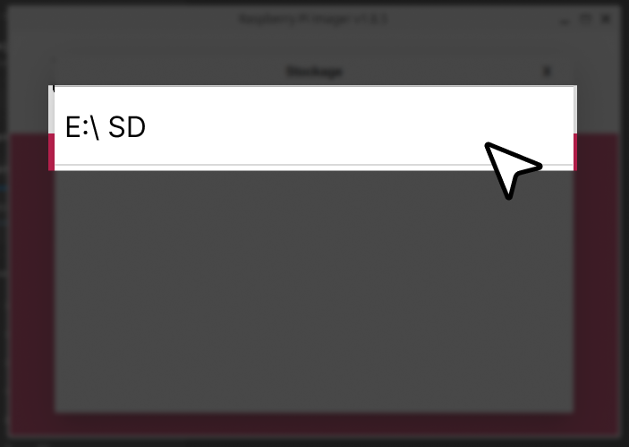

# Installation du Système

Le guide suivant permet de mettre en place les raspberry pi pour le projet.

## 1. Installation de l'OS

On commence par préparer l'OS

### Chargement de l'OS sur la cardSD:

Pour chacun des raspberry pi il faudra charger un RaspBian. Nous allons ici utiliser (trixie qui est la version LTS : x.x.x de Raspbian dans sa version NO-DESKTOP pour alléger les processus)

Pour ce faire installer rpi imager sur votre ordinateur

Avec https://www.raspberrypi.com/software/

ou sur linux 

```bash
sudo apt install rpi-imager
```

#### Etape 1



#### Etape 2



#### Etape 3



#### Etape 4



#### Etape 5



#### Etape 6



#### Configuration de la carte

Insérez ensuite la carte microSD dans la Raspberry Pi, mettez sous tension et suivez les instructions à l'écran.

Configurez votre langue, votre clavier et votre mot de passe.

Branchez sur votre réseau un câble Ethernet et passez à l'étape suivante.

:::danger
Si vous n'avez pas de connexion internet filaire, il faut configurer le WIFI.

Pour ce faire, entrez :

```bash
sudo raspi-config
```

Cliqué sur interface puis Wireless LAN entré le nom du wifi (SSID) et le mots de passe.
:::

## Préparation des environnements

Inserer ensuite la carte microSD dans la raspberry pi, mettez sous tension et suivez les instructions à l'écran.

### Installation des dépendances

Pour ce projet nous aurons besoin d'installer sur la raspberry pi les logiciels suivants :

> - GNU Radio
> - NodeJS >= 22

#### Installation de GNU Radio

On commence par mettre à jour le systeme

Sur ubuntu >= 22.04

```bash
sudo apt-get update
sudo apt-get install gnuradio
```

Sinon voir 
https://wiki.gnuradio.org/index.php/InstallingGR

#### Installation de NodeJS >= 22

```bash
# Download and install nvm:
curl -o- https://raw.githubusercontent.com/nvm-sh/nvm/v0.40.3/install.sh | bash

# in lieu of restarting the shell
\. "$HOME/.nvm/nvm.sh"

# Download and install Node.js:
nvm install 22

# Verify the Node.js version:
node -v # Should print "v22.22.0".

# Download and install Yarn:
corepack enable yarn

# Verify Yarn version:
yarn -v
```

##### Installation de PM2

```bash
yarn global add pm2
```

Documentation pm2
https://pm2.keymetrics.io/docs/usage/quick-start/

## 2. Configuration Réseau (Statique)

Dans le cas où il n'y a pas de routeur il faut configurer pour le serveur une ip statique pour que ce soit stable, ici on va utiliser le NetworkManager pour relier une ip static à l'interface `eth0` (ethernet).

```bash
# Configuration de l'interface "Wired connection 1" qui est "eth0"
sudo nmcli con mod "Wired connection 1" \ 
  ipv4.addresses 192.168.10.X/24 \ 
  ipv4.method manual
# On applique la configuration
sudo nmcli con up "Wired connection 1"
```

:::danger
Vous devez remplacer `X` par un numéro strictement différent des autres raspberry pi et différent de 0, 254 et 255 qui sont des resolver réservé au réseau, hub et passerrelle.
:::

:::danger
Dans le cas où vous utilisé une carte son: IQAudio Zero Codec, vous devez suivre les informations via ce lien: [IQAudio Installation](/guide/module/carte-son/installation)
:::

## 3. Installation du service client

Placer à la racine le fichier client.py

### Lancement automatique au démarrage avec pm2 <Badge type="tip" text="production" />

#### 1. Installation

On commence par installer pm2

```bash
pm2 start client.py --interpreter python3
```

#### 2. Consulté le status avec

```bash
pm2 status
```

#### 3. Lancement au démmarrage du client

```bash
pm2 startup
```

### Lancement manuel <Badge type="tip" text="debug" />

Executer le fichier `client.py` avec

```bash
python3 client.py
```
