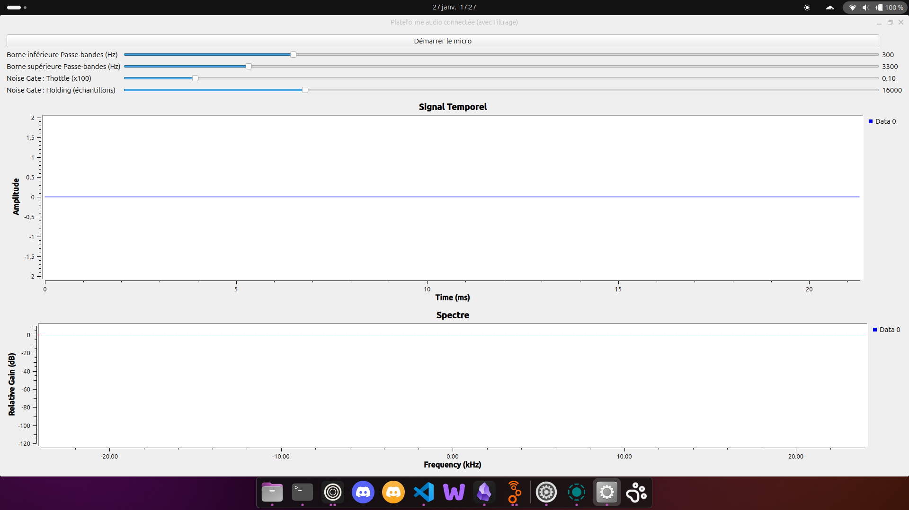
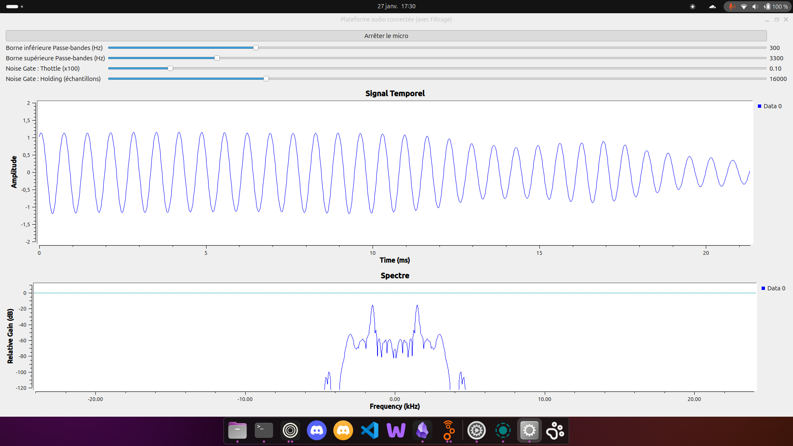

# 27 Janvier 2026

:::info
Séance réalisé en salle 103
:::

## Taches qui était prévues pour la séance

> **Faire fonctionner la V1 du projet sur PC (Serveur) <-> PC (Client)**  

> **Faire fonctionner la V1 du projet sur PC (Serveur) <-> Raspberry PI (CLient)**  

> **Faire sortir le son via l'IQAudio branché sur les GPIO du RaspberryPI**  

> **Extraire le FlowGraph du code de la V1 pour GNURadio**

## Fait 

Mise en place du projet (installation distro : Debian Serveur (Rapsbian))
Faire fonctionner la V1 du projet sur PC (Serveur) <-> PC (Client)
Faire fonctionner la V1 du projet sur PC (Serveur) <-> Raspberry PI (CLient)
Lecture de l'archive de la V1

## A corriger

Faire sortir le son via l'IQAudio branché sur les GPIO du RaspberryPI
Extraire le F00lowGraph du code de la V1 pour GNURadio

## Problème rencontrer

Le code fournis dans la V1 est incomplet il manque le bloc le module NoiseGate (Python emebed block) dans l'archive donc il a fallu recrée le FlowGraph sur GNURadio pour pouvoir le récupérer et faire fonctionner le code Serveur.

